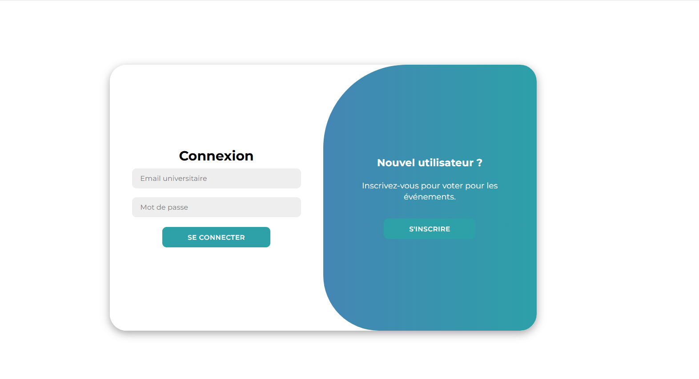
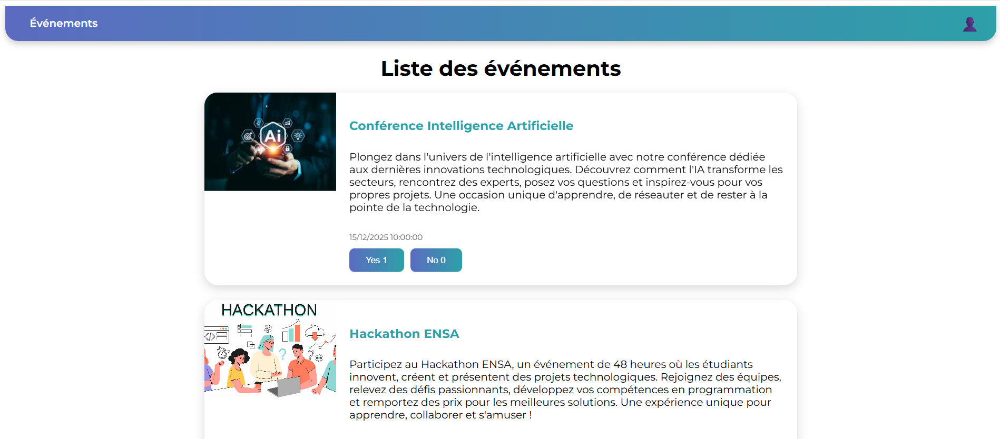

# TP6 Vue.js - ENSA Events

Une application **Vue.js** permettant aux étudiants de voter pour des événements.  
L'application utilise **Firebase Authentication** pour l'authentification et **Firestore** pour stocker les votes.

---

## 🌐 Site déployé

Vous pouvez consulter l'application en ligne ici :  
[https://ensa-events-63464.web.app](https://ensa-events-63464.web.app)

---

## 🖥️ Captures d'écran

### Page de connexion


### Liste des événements


---

## ⚙️ Installation et lancement

1. Cloner le projet :

```bash
git clone <lien-du-depot-github>

2. Installer les dépendances :

```bash
npm install

3. Lancer l'application en mode développement :

```bash
npm run dev

## 💡 Fonctionnalités

- Authentification uniquement pour les emails universitaires (`@uca.ac.ma`)  
- Création de compte et connexion sécurisée  
- Liste des événements avec possibilité de voter **Yes/No**  
- Empêche le double vote pour un même événement  
- Application déployée sur Firebase Hosting  

